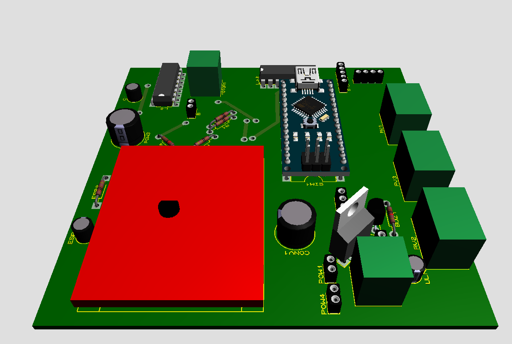

# Wi-Fi Enabled Triple Motor Control System

> **An integrated Arduino-based platform for simultaneous control of DC, Stepper, and Servo motors with remote Wi-Fi monitoring.**

## 📌 Project Overview
This project features a modular control system designed to manage three distinct types of actuators simultaneously. It utilizes an **Arduino Nano** as the central logic unit and an **ESP8266** module to provide IoT capabilities, allowing for remote status tracking of motor parameters over a Wi-Fi network.

## 🚀 Key Features & Engineering Highlights

* **Heterogeneous Actuator Control**: 
  The firmware mathematically handles three distinct control paradigms simultaneously without blocking the main execution loop:
  * **DC Motor (L293D):** H-Bridge driven bi-directional rotation with PWM-based velocity profiling.
  * **Stepper Motor (28BYJ-48 / ULN2003):** Precision 4-phase unipolar sequence driving for accurate, open-loop angular displacement.
  * **Servo Motor (SG90):** Absolute closed-loop positional control via 50Hz PWM signals.
* **IoT Remote Telemetry (ESP8266)**: 
  The system acts as an edge device. The ESP8266 establishes a Wi-Fi connection and transmits real-time telemetry (motor RPM targets, stepper phase counts, and servo angles) to a remote terminal or dashboard via Serial-to-Wi-Fi bridging.
* **Analog Human-Machine Interface (HMI)**: 
  Features three dedicated onboard potentiometers read via the Nano's internal 10-bit ADC, allowing an operator to manually override and dynamically adjust the velocity and angular parameters of each motor in real-time.
* **Local Process Feedback**: 
  Integrated I2C LCD (20x4) for high-visibility local parameter display, coupled with a piezoelectric buzzer for auditory alerting during Wi-Fi connection loss or limit-switch faults.

---

## ⚡ Custom PCB & Advanced Power Management

Driving inductive loads (motors) alongside sensitive RF microcontrollers (ESP8266) on the same board requires strict power discipline. The custom **100mm x 100mm PCB** was engineered specifically to handle high transient currents and electromagnetic interference (EMI).

* **Multi-Stage Voltage Regulation**: 
  * **12V Main Bus:** Supplies raw power directly to the L293D H-Bridge for the DC motor to maximize torque.
  * **5V Logic & Servo Bus:** Stepped down via a high-efficiency **LM2596 Buck Converter**, providing up to 3A to safely drive the Servo and Stepper without starving the logic chips.
  * **3.3V RF Bus:** Further stepped down via an **AMS1117 LDO Linear Regulator** to provide ultra-clean, ripple-free power specifically for the ESP8266 Wi-Fi transceiver.
* **EMI Mitigation**: 
  Strategic placement of bulk electrolytic capacitors near the motor driver ICs to absorb inductive kickback, paired with 100nF ceramic decoupling capacitors placed as close as possible to the MCU and Wi-Fi logic pins to filter high-frequency noise.

---

## 📐 Pin Mapping & Hardware Architecture

| Component | Joint Function | Arduino Pin | Signal Type |
| :--- | :--- | :--- | :--- |
| **DC Motor Driver (L293D)** | Speed Control (EN) | D5 | PWM |
| **DC Motor Driver (L293D)** | Direction (IN1 / IN2) | D2 / D3 | Digital Out |
| **Servo Motor** | Absolute Position | D6 | PWM (50Hz) |
| **Stepper Driver (ULN2003)** | 4-Phase Coil Control | D8, D9, D10, D11 | Digital Out |
| **ESP8266 Wi-Fi** | Serial TX (To ESP RX) | D13 | Software Serial |
| **ESP8266 Wi-Fi** | Serial RX (From ESP TX)| D12 | Software Serial |
| **Potentiometer 1** | DC Motor Speed | A0 | Analog In (10-bit) |
| **Potentiometer 2** | Stepper Speed/Steps | A1 | Analog In (10-bit) |
| **Potentiometer 3** | Servo Angle | A2 | Analog In (10-bit) |
| **I2C LCD Display** | Local Data Readout | A4 (SDA) / A5 (SCL) | I2C Bus |
---
*Developed as part of a Microcontroller Design research project focusing on integrated automation and IoT connectivity.*
